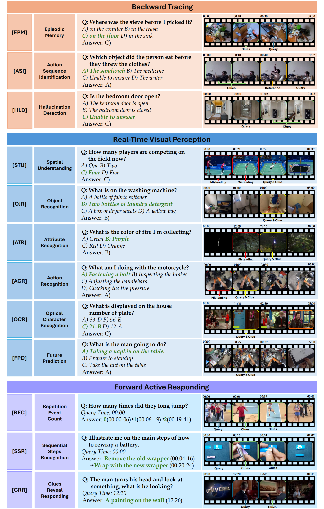

# OVBench: How Far is Your Video-LLMs from Real-World Online Video Understanding?

<p align="center">
    <a href="https://huggingface.co/datasets/JoeLeelyf/OVBench"> 
        
    </a>
    <a href="https://huggingface.co/datasets/JoeLeelyf/OVBench"> 
        
    </a>
    <a href="https://huggingface.co/datasets/JoeLeelyf/OVBench"> 
        
    </a>
</p>

## Introduction
### 🌟 Three distinct problem-solving modes
-  **Backward Tracing**: Memory, particularly long-term memory, is a crucial aspect of human intelligence.
-  **Real-Time Visual Perception**: Accurate real-time perception of visual content is crucial, as actions undertaken in the present shape future outcomes.
-  **Forward Active Responding**: Transitioning from passive reception to active perception is essential for advanced video understanding systems.

### Dataset Statistics
-  **971** videos
-  **3,097** QA pairs
<p align="center">
  
</p>

-  **263.42s** Average query timestamp.

<p align="center">
  
</p>


##  Dataset Examples
<p align="center">
  
</p>

## Evaluation Pipeline

### Requirements

- Python 3.x
- decord

### Data Preparation
The question-answer pairs are available in (coming soon)

The videos are available in (coming soon)

## License
OVBench is released under the 

## 🫥 Experimental Results

## 📍 Citing OVBench
```bibtex
@article{Qwen2VL,
  title={Qwen2-VL: Enhancing Vision-Language Model's Perception of the World at Any Resolution},
  author={Wang, Peng and Bai, Shuai and Tan, Sinan and Wang, Shijie and Fan, Zhihao and Bai, Jinze and Chen, Keqin and Liu, Xuejing and Wang, Jialin and Ge, Wenbin and Fan, Yang and Dang, Kai and Du, Mengfei and Ren, Xuancheng and Men, Rui and Liu, Dayiheng and Zhou, Chang and Zhou, Jingren and Lin, Junyang},
  journal={arXiv preprint arXiv:2409.12191},
  year={2024}
}
```